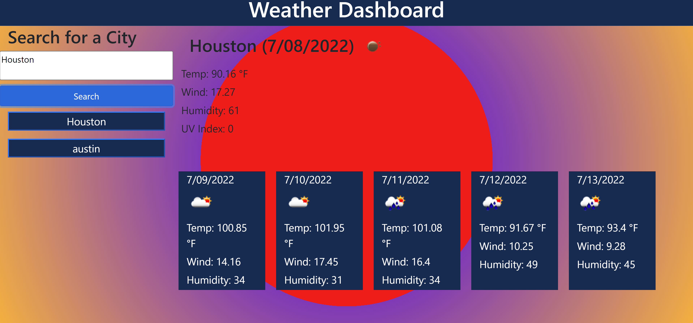

# Weather Forecasting API

### Technologies Utilized
- HTML
- CSS
- Bootstrap
- JavaScript
- JSON
- Local Storage

## General Website Use
 - Landing Page
    - 
- Search for a new city by typing a city name in the box and clicking the SEARCH button
    - 
- The page will change according to the city and its current temperature
    - 
- The current temperature will effect the background based on if its HOT, COLD, or MODERATE
    - COLD
        - 
    - HOT
        - 
    - MODERATE
        - 
- Weather Data
    - The location you give will provide back the city NAME, the current DATE, and an icon representing the current weather conditions (sunny, cloud, rain, etc.):
        - 
    - Below that, you'll be given the temperate, humidity, UV index and windspeed:
        - 
    - Additionally, the city you chose will provide a 5 day future weather forecast:
        - 